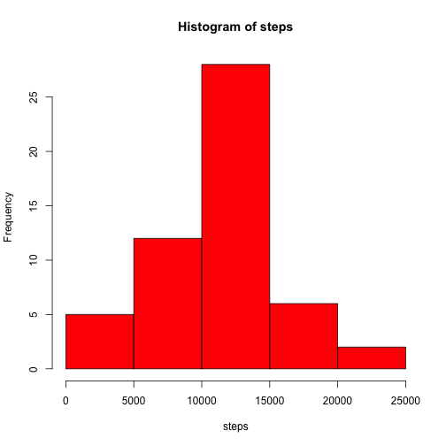
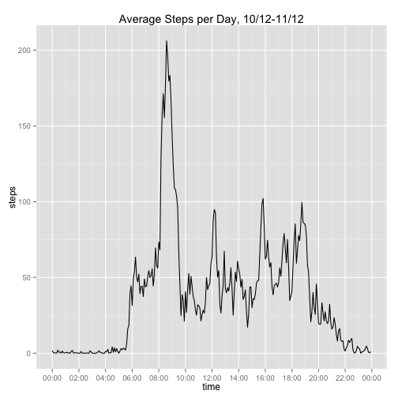
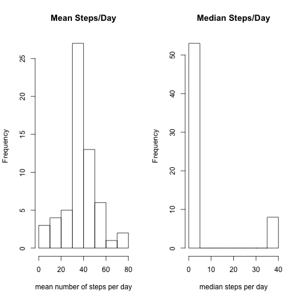
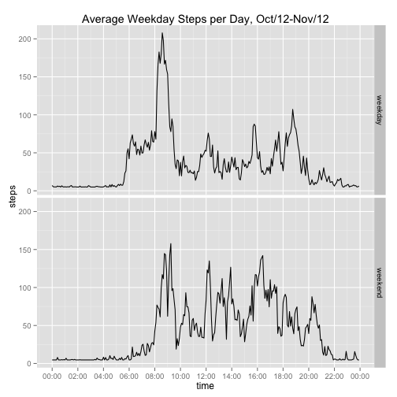

##Intro Code

## Loading and preprocessing the data

```r
activ <- read.csv("activity.csv")
daily_steps <- tapply(activ$steps, activ$date, sum)
steps <- daily_steps[!is.na(daily_steps[])]
```

## What is mean total number of steps taken per day?

```r
par(mfrow = c(1, 1))
hist(steps, col="red")
```

 

```r
#dev.copy(png, filename="./figure/steps_histogram1.png")
#dev.off()
summary(steps)
```

```
##    Min. 1st Qu.  Median    Mean 3rd Qu.    Max. 
##      41    8841   10760   10770   13290   21190
```

## What is the average daily activity pattern?


```r
activ2 <-activ[!is.na(activ[,1]),]
average_steps <- aggregate(activ2$steps, list(activ2$interval), mean)
colnames(average_steps)<- c("interval", "steps")
#Convert the military time to regular time, and add it to a new "time" column
average_steps$time <- as.POSIXct(average_steps$interval%/%100*3600+average_steps$interval%%100*60, "%H:%M:%S", origin = "2000-01-01 00:00:00")
library(ggplot2)
library(scales)
m <- qplot(time, steps, data = average_steps, geom = c("line"), main="Average Steps per Day, 10/12-11/12")
m+scale_x_datetime(breaks = date_breaks("120 min"), labels = date_format("%H:%M"))
```

 

```r
#dev.copy(png, file = "./figure/averagedailypattern1.png")
#dev.off()
average_steps$steps <- round(average_steps$steps, 3)
#Look at summary to find what the max steps are
summary(average_steps)
```

```
##     interval          steps              time                    
##  Min.   :   0.0   Min.   :  0.000   Min.   :2000-01-01 00:00:00  
##  1st Qu.: 588.8   1st Qu.:  2.486   1st Qu.:2000-01-01 05:58:45  
##  Median :1177.5   Median : 34.113   Median :2000-01-01 11:57:30  
##  Mean   :1177.5   Mean   : 37.383   Mean   :2000-01-01 11:57:30  
##  3rd Qu.:1766.2   3rd Qu.: 52.834   3rd Qu.:2000-01-01 17:56:15  
##  Max.   :2355.0   Max.   :206.170   Max.   :2000-01-01 23:55:00
```

```r
#Find what time of day the max steps (206.170) is
average_steps[average_steps$steps==206.170,]
```

```
##     interval  steps                time
## 104      835 206.17 2000-01-01 08:35:00
```

## Imputing missing values

```r
na_count <- activ[is.na(activ[,1]),]
#count number of n/a rows
nrow(na_count)
```

```
## [1] 2304
```

```r
# Devise strategy for imputing missing NAs
# I'll use the average daily steps to replace all NAs. The mean is provided in the summary data.
summary(activ)
```

```
##      steps                date          interval     
##  Min.   :  0.00   2012-10-01:  288   Min.   :   0.0  
##  1st Qu.:  0.00   2012-10-02:  288   1st Qu.: 588.8  
##  Median :  0.00   2012-10-03:  288   Median :1177.5  
##  Mean   : 37.38   2012-10-04:  288   Mean   :1177.5  
##  3rd Qu.: 12.00   2012-10-05:  288   3rd Qu.:1766.2  
##  Max.   :806.00   2012-10-06:  288   Max.   :2355.0  
##  NA's   :2304     (Other)   :15840
```

```r
#The summary data shows that the mean steps per day is 37.38
activ3 <- activ
#Next, create dataset with the NA values replaced with 37.38
activ3[is.na(activ3)] <- 37.38
par(mfrow = c(1, 2))
new_stps_mean<- aggregate(activ3$steps, list(activ3$date), mean)
colnames(new_stps_mean)<- c("date", "average steps")
hist(new_stps_mean[,2], xlab="mean number of steps per day", main="Mean Steps/Day")
new_stps_median<- aggregate(activ3$steps, list(activ3$date), median)
colnames(new_stps_median)<- c("date", "average steps")
hist(new_stps_median[,2], xlab="median steps per day", main="Median Steps/Day")
```

 

```r
#dev.copy(png, file = "./figure/median_mean_w_nas_imputed1.png")
#dev.off()
summary(new_stps_mean)
```

```
##          date    average steps    
##  2012-10-01: 1   Min.   : 0.1424  
##  2012-10-02: 1   1st Qu.:34.0938  
##  2012-10-03: 1   Median :37.3800  
##  2012-10-04: 1   Mean   :37.3823  
##  2012-10-05: 1   3rd Qu.:44.4826  
##  2012-10-06: 1   Max.   :73.5903  
##  (Other)   :55
```

```r
summary(new_stps_median)
```

```
##          date    average steps   
##  2012-10-01: 1   Min.   : 0.000  
##  2012-10-02: 1   1st Qu.: 0.000  
##  2012-10-03: 1   Median : 0.000  
##  2012-10-04: 1   Mean   : 4.902  
##  2012-10-05: 1   3rd Qu.: 0.000  
##  2012-10-06: 1   Max.   :37.380  
##  (Other)   :55
```

```r
#On most days, the most common # of steps per 5 minute interval is 0, so the median is often 0.
```

## Are there differences in activity patterns between weekdays and weekends?

```r
activ3$date <- as.Date(activ3$date)
#Let's make sure the date is now a date (not a factor)
str(activ3)
```

```
## 'data.frame':	17568 obs. of  3 variables:
##  $ steps   : num  37.4 37.4 37.4 37.4 37.4 ...
##  $ date    : Date, format: "2012-10-01" "2012-10-01" ...
##  $ interval: int  0 5 10 15 20 25 30 35 40 45 ...
```

```r
activ3$weekday<- weekdays(activ3$date)
#separate weekends from weekdays
activ3$day <- ifelse(activ3$weekday=="Sunday"|activ3$weekday=="Saturday", "Weekend", "Weekday") 

#find average steps for each 5-minute increment over the weekend
weekend <- subset(activ3, day=="Weekend")
wknd_stps <- aggregate(weekend$steps, list(weekend$interval), mean)
colnames(wknd_stps)<- c("interval", "steps")
wknd_stps$time <- as.POSIXct(wknd_stps$interval%/%100*3600+wknd_stps$interval%%100*60, "%H:%M:%S", origin = "2000-01-01 00:00:00")
wknd_stps$day <- "weekend"

#find average steps for each 5-minute increment during the week
weekday <- subset(activ3, day=="Weekday")
wk_stps <- aggregate(weekday$steps, list(weekday$interval), mean)
colnames(wk_stps)<- c("interval", "steps")
wk_stps$time <- as.POSIXct(wk_stps$interval%/%100*3600+wk_stps$interval%%100*60, "%H:%M:%S", origin = "2000-01-01 00:00:00")
wk_stps$day <- "weekday"

#combine weekend and weekdays and make graphs for each
all_steps <- rbind(wknd_stps, wk_stps)
week <- qplot(time, steps, data = all_steps, geom = c("line"), main="Average Weekday Steps per Day, Oct/12-Nov/12", facets = day~.)
week+scale_x_datetime(breaks = date_breaks("120 min"), labels = date_format("%H:%M"))
```

 

```r
#dev.copy(png, file = "./figure/wknd_v_wkdays1.png")
#dev.off()
```
